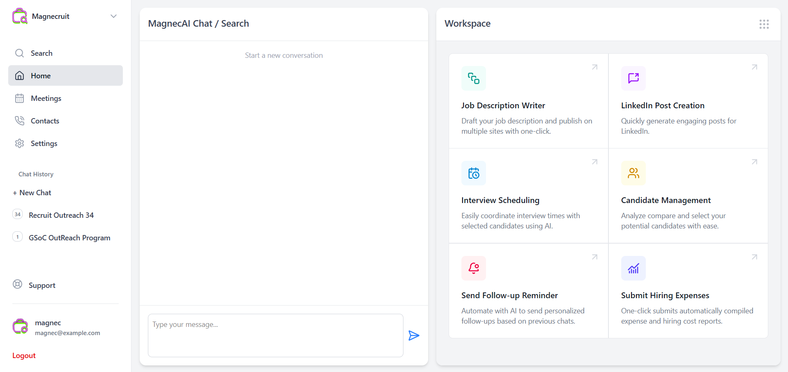

## Magnecruit: AI-Powered Recruitment Workspace

**Magnecruit** is a smart, AI-driven web application designed to streamline and enhance recruitment workflows. It provides a unified workspace where recruiters can leverage the power of large language models (LLMs) through a conversational interface to automate and assist with various hiring tasks.

The core feature demonstrated is the 🧠 **MagnecAI Chat**, which allows users to interact with an AI assistant (powered by Google Gemini) to collaboratively create and refine multi-step candidate outreach sequences.

### 🔑 Key Features:

  * **AI Chat Assistant (MagnecAI):** Engage in natural language conversations to generate recruitment content and perform actions.
  * **Conversational Sequence Generation:** Chat with the AI to define the goal, tone, target audience, and steps for an outreach sequence (e.g., emails, LinkedIn messages).
  * **Live Sequence Workspace:** As the sequence is developed through chat, it appears and updates in real-time in a dedicated "Sequence Curator" view within the workspace.
  * **Direct Editing:** Users can manually edit the sequence details (title, description, steps) directly in the workspace view and save for future preferences.
  * **AI-Powered Editing:** Users can ask the AI assistant via chat to make specific modifications to the existing sequence (e.g., "Make step 2 more casual," "Add a LinkedIn connection request as step 1").
  * **Persistent Conversations:** Chat history is saved per user, allowing context to be maintained across sessions.
  * **User Authentication:** Secure login and session management for individual user workspaces.
  * **Modular Workspace:** Designed to host various recruitment tools (Sequence Curator, Job Description Writer, etc.) accessible from a central grid.

### ⚙️ How it Works (Sequence Generation Example):

1.  A logged-in user starts a chat with MagnecAI, describing the desired outreach sequence.
2.  The React frontend sends the message via **Socket.IO** to the Flask backend.
3.  The backend `sequence_service` retrieves conversation history and the current sequence state (if any) from the database (**SQLAlchemy/PostgreSQL**).
4.  An appropriate prompt is constructed (**Prompt Engineering**) and sent to the **Google Gemini LLM** via the `llm_interface`.
5.  The LLM responds, either asking clarifying questions or providing the sequence structure formatted as JSON.
6.  The backend **parses** the potential JSON from the LLM response.
7.  If valid sequence data is found, it's saved or updated in the database.
8.  The backend emits the raw AI response back to the chat UI and emits a `sequence_updated` event with the new sequence data via Socket.IO.
9.  The React frontend updates the `ChatBar` with the AI's message and the `SequenceCuratorView` in the `Workspace` with the live sequence data.

### 🛠️ Tech Stack

#### **Frontend**
- React, TypeScript, JavaScript
- State Management (React Hooks)
- Component-Based Architecture
- Responsive Design, UI Development
- Tailwind CSS
- React Markdown
- WebSocket Integration (Socket.IO Client)

#### **Backend**
- Python, Flask
- REST API Design & Development
- WebSocket Communication (Flask-SocketIO)
- ORM: SQLAlchemy (Flask-SQLAlchemy, Flask-Migrate)
- CORS Handling (Flask-CORS)
- Authentication & Session Management
- Error Handling

#### **AI / LLM Integration**
- Google Gemini API
- Prompt Engineering
- LLM Orchestration & Agentic Design
- JSON Response Parsing
- API Interaction

#### **Full-Stack & Architecture**
- Full-Stack Development
- System Design (Frontend/Backend Communication)
- Real-Time Applications (WebSockets + REST APIs)

#### **Database**
- PostgreSQL
- Relational Database Design & Data Modeling

#### **DevOps / General Tools**
- Git & Version Control
- Environment Variable Management

### 🚀 Setup & Installation

1.  **Prerequisites:** Node.js, npm/yarn, Python, pip, PostgreSQL (or other DB)
2.  **Backend Setup:**
      * Clone repository
      * Create virtual environment (`python -m venv venv`)
      * Activate environment (`source venv/bin/activate` or `venv\Scripts\activate`)
      * Install dependencies (`pip install -r requirements.txt`)
      * Set up database and run migrations (`flask db upgrade`)
      * Set Environment Variables (especially `GEMINI_API_KEY`, `DATABASE_URL`, `SECRET_KEY`, `ALLOWED_ORIGINS`)
      * Run backend (`flask run` or using a WSGI server like Gunicorn/Waitress with Eventlet/Gevent for SocketIO)
3.  **Frontend Setup:**
      * Navigate to frontend directory (`cd magnecruit_frontend`)
      * Install dependencies (`npm install` or `yarn install`)
      * Run frontend (`npm run dev` or `yarn dev`)
4.  Access the application (usually `http://localhost:5173` or similar).

-----

